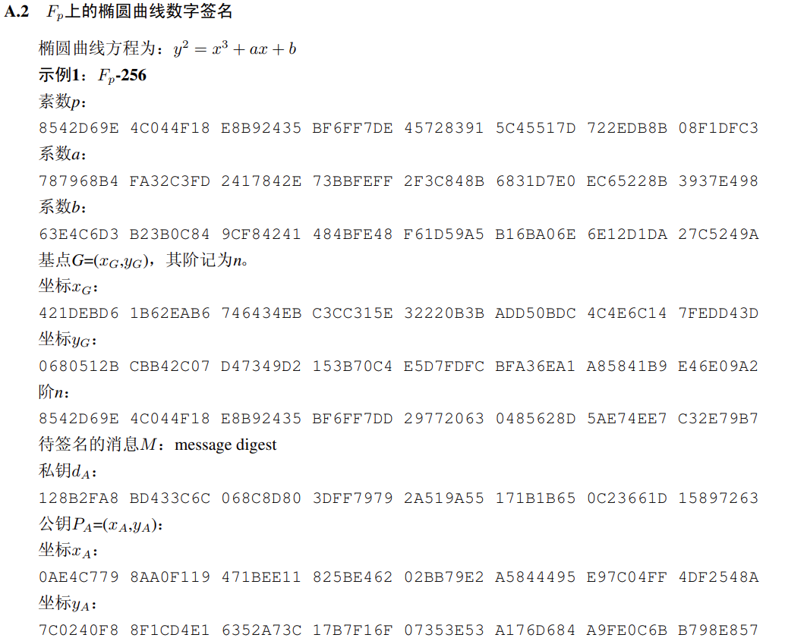
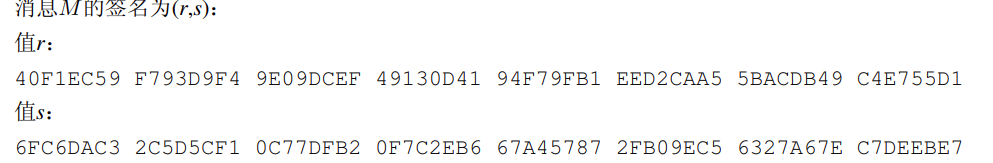
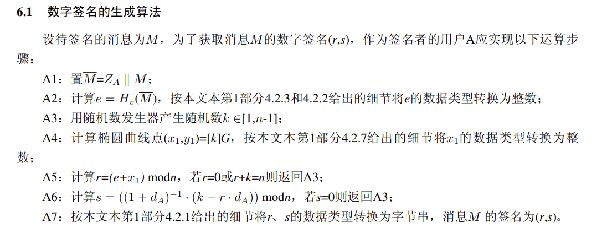
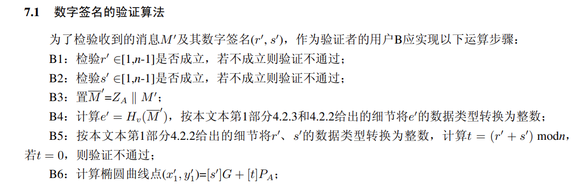
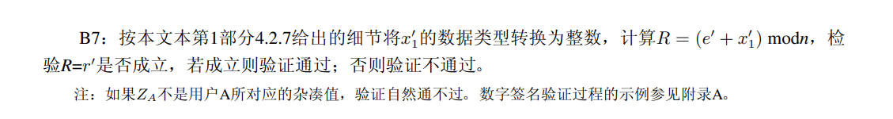
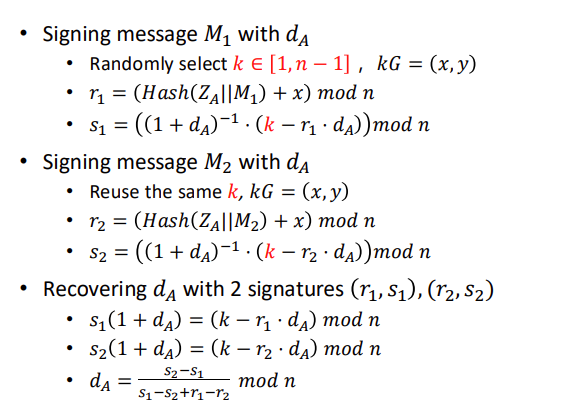
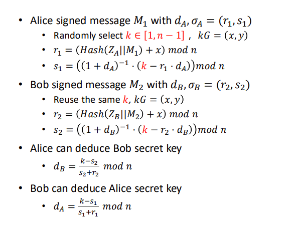
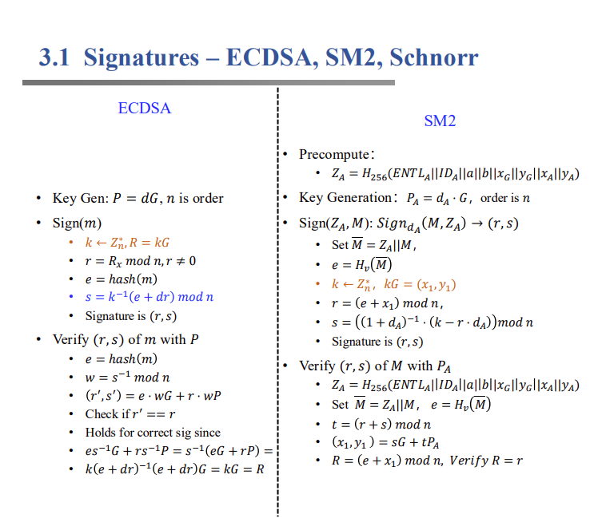
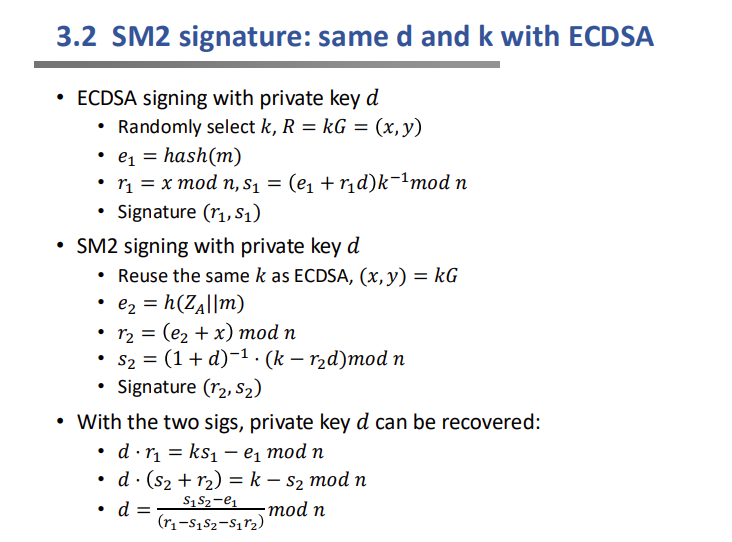

# Project 5: SM2的软件实现优化

## 快速开始

可以直接执行：

```
python SM2_signature.py
python SM2.py
```

## 前言

**SM2是**[国家密码管理局](https://baike.baidu.com/item/%E5%9B%BD%E5%AE%B6%E5%AF%86%E7%A0%81%E7%AE%A1%E7%90%86%E5%B1%80/2712999?fromModule=lemma_inlink)于2010年12月17日发布的椭圆曲线公钥密码算法。

它的[标准手册](b791a9f908bb4803875ab6aeeb7b4e03.pdf)有93页，虽然大部分都是有关有限域上的知识介绍以及案例，但是仍然会让人看的头皮发麻，所以本部分会对实现的思路进行概括说明，旨在帮助理解。

本项目主要侧重于SM2实现的数字签名算法，相关代码在文件 `./SM2_signature.py`中。除此之外我实现了SM2的加解密算法，代码在 `./SM2.py`中。

如果你想要从原理开始了解，可以先看第三部分：SM2签名算法原理。

如果你想要快速了解代码以及cop演示，可以直接看下面。

## SM2签名算法介绍&与k有关的攻击cop

### 基本组成介绍

该签名算法的代码写在了文件 `./SM2_signature.py`中，其中最重要的两个函数是：

```python
def sign(self, message, private_key, public_key, ID="ALICE123@YAHOO.COM"):
        """
        SM2数字签名生成
        参数:
            message: 待签名的消息 (字符串)
            private_key: 私钥 (整数)
            public_key: 公钥 (元组 (x, y))
            ID: 用户身份标识 (字符串)
        返回:
            签名 (r, s)
        """
        ......

def verify(self, message, signature, public_key, ID="ALICE123@YAHOO.COM"):
        """
        SM2数字签名验证
        参数:
            message: 原始消息 (字符串)
            signature: 签名 (元组 (r, s))
            public_key: 公钥 (元组 (x, y))
            ID: 用户身份标识 (字符串)
        返回:
            验证结果 (布尔值)
        """
	......
```

分别实现了签名功能和验证功能，篇幅限制这里就不再赘述具体的代码了，你可以去代码文件中查看。当然，这两个函数是 `SM2类`的类函数，同时我使用的椭圆曲线是F_p-256:

```python
class SM2:
    def __init__(self):
        # 椭圆曲线系统参数
        self.p = 0x8542D69E4C044F18E8B92435BF6FF7DE457283915C45517D722EDB8B08F1DFC3
        self.a = 0x787968B4FA32C3FD2417842E73BBFEFF2F3C848B6831D7E0EC65228B3937E498
        self.b = 0x63E4C6D3B23B0C849CF84241484BFE48F61D59A5B16BA06E6E12D1DA27C5249A
        self.h = 1
        self.Gx = 0x421DEBD61B62EAB6746434EBC3CC315E32220B3BADD50BDC4C4E6C147FEDD43D
        self.Gy = 0x0680512BCBB42C07D47349D2153B70C4E5D7FDFCBFA36EA1A85841B9E46E09A2
        self.n = 0x8542D69E4C044F18E8B92435BF6FF7DD297720630485628D5AE74EE7C32E79B7
        ......
```

为了方便验证以及展开攻击poc，我还改写了一个 `sign`函数的变体 `sign_att`，这个函数与 `sign`函数唯一的不同就是它可以手动设置具体的k值：

```python
def sign_att(self, message, private_key, public_key,k_set,ID="ALICE123@YAHOO.COM"):
        """
        SM2数字签名生成
        参数:
            message: 待签名的消息 (字符串)
            private_key: 私钥 (整数)
            public_key: 公钥 (元组 (x, y))
            k_set: 手动设置的k (整数)
            ID: 用户身份标识 (字符串)
        返回:
            签名 (r, s)
        """
```

除了上述函数之外，在 `sm2`类里面，还实现了整数，字节串，域元素，点之间的转换函数：

```python
def int_to_bytes(self, x, k=None):
def bytes_to_int(self, M):
def fielde_to_bytes(self, e):
def bytes_to_fielde(self, M):
def point_to_bytes(self, P):
def bytes_to_point(self, s):
```

当然还有模逆运算以及椭圆曲线上的点运算：

```python
def mod_inverse(self, a, m):
def point_add(self, P, Q):
def point_double(self, P):
def point_mult(self, k, P):
def on_curve(self, P):
def compute_ZA(self, ID, public_key):
```

### 算法正确性验证

这一小部分展示签名算法的正确性，由于国密标准手册中只给了一个指定的k值所生成的签名，所以我们暂时用sign_att代替sign函数，手动设置一个k值，验证代码如下：

```python
print("SM2数字签名算法".center(80, '='))
    sm2 = SM2()
    # 生成密钥对
    print("\n生成密钥对...")
    private_key = 0x128B2FA8BD433C6C068C8D803DFF79792A519A55171B1B650C23661D15897263
    public_key = (0x0AE4C7798AA0F119471BEE11825BE46202BB79E2A5844495E97C04FF4DF2548A,
                  0x7C0240F88F1CD4E16352A73C17B7F16F07353E53A176D684A9FE0C6BB798E857)
  
    print("=====验证功能=====")
  
    # 显示公钥信息
    print(f"公钥: ({hex(public_key[0])}, {hex(public_key[1])})")
  
    # 要签名的消息
    message = "message digest"
    print(f"\n要签名的消息: '{message}'")
  
    # 生成签名
    print("\n生成签名...")
    k=0x6CB28D99385C175C94F94E934817663FC176D925DD72B727260DBAAE1FB2F96F
    signature = sm2.sign_att(message, private_key, public_key,k)
    r, s = signature
    print(f"签名结果: r={hex(r)}, s={hex(s)}")
  
    # 验证签名
    print("\n验证签名...")
    is_valid = sm2.verify(message, signature, public_key)
  
    # 显示验证结果
    print("\n验证结果:")
    if is_valid:
        print("签名验证成功！")
    else:
        print("签名验证失败！")
  
    # 篡改消息测试
    print("\n篡改消息测试...")
    tampered_message = message + "（已篡改）"
    print(f"篡改后的消息: '{tampered_message}'")
    is_valid_tampered = sm2.verify(tampered_message, signature, public_key)
    print(f"验证结果: {'成功' if is_valid_tampered else '失败'} (预期结果: 失败)")
  
    # 篡改签名测试
    print("\n篡改签名测试...")
    tampered_signature = (r, s + 1)  # 修改s值
    is_valid_tampered_sig = sm2.verify(message, tampered_signature, public_key)
    print(f"验证结果: {'成功' if is_valid_tampered_sig else '失败'} (预期结果: 失败)")
```

我们设置的公私钥，ID，message等都是国密标准文档中的示例：




最终签名算法生成的r，s的值为：



当运行我们的代码，会输出：

```python
PS E:\VScodeprogram\project5-SM2>  e:; cd 'e:\VScodeprogram\project5-SM2'; & 'c:\Users\LENOVO\AppData\Local\Programs\Python\Python311\python.exe' 'c:\Users\LENOVO\.vscode\extensions\ms-python.debugpy-2025.10.0-win32-x64\bundled\libs\debugpy\launcher' '64085' '--' 'E:\VScodeprogram\project5-SM2\SM2_signature.py'
===================================SM2数字签名算法====================================

生成密钥对...
=====验证功能=====
公钥: (0xae4c7798aa0f119471bee11825be46202bb79e2a5844495e97c04ff4df2548a, 0x7c0240f88f1cd4e16352a73c17b7f16f07353e53a176d684a9fe0c6bb798e857)

要签名的消息: 'message digest'

生成签名...
签名结果: r=0x40f1ec59f793d9f49e09dcef49130d4194f79fb1eed2caa55bacdb49c4e755d1, s=0x6fc6dac32c5d5cf10c77dfb20f7c2eb667a457872fb09ec56327a67ec7deebe7

验证签名...

验证结果:
签名验证成功！

篡改消息测试...
篡改后的消息: 'message digest（已篡改）'
验证结果: 失败 (预期结果: 失败)

篡改签名测试...
验证结果: 失败 (预期结果: 失败)
```

 可以观察到生成的r和s值与示例相同，同时它也通过了签名验证。如果我们篡改消息，那么再次验证就会失败。

这里只展示签名最终生成的r和s值，由于验证跟签名算法中的中间值基本相同，只要签名函数正确，验证函数就没什么问题，所以只要观察验证函数通不通过即可，也不需要特意观察中间值。事实上，我已经在调试过程中比对了中间值，所以不用担心正确性的问题。如果读者有意也可以手动调试一下对中间值进行验证。

### 与k有关的攻击poc

这部分内容代码很简单，建议对照下面原理中对k的攻击的解释一并食用。

#### k泄露

```python
 #k泄露，我们可以手动设定k
    print("\n\n")
    print("=====如果k泄露======")
    k=0x6CB28D99385C175C94F94E934817663FC176D925DD72B727260DBAAE1FB2F96F
    # 生成签名
    print("生成签名...")
    signature = sm2.sign_att(message, private_key, public_key,k)
    r, s = signature
    #attacker
    dA=(sm2.mod_inverse((s+r)%sm2.n,sm2.n)*((k-s+sm2.n)%sm2.n))%sm2.n
    print("攻击者的私钥:",hex(dA))
```

公私钥等信息仍然延续刚才进行功能测试。最终我们可以还原出私钥，终端中输出：

```python
=====如果k泄露======
生成签名...
攻击者的私钥: 0x128b2fa8bd433c6c068c8d803dff79792a519a55171b1b650c23661d15897263
```

这个私钥跟刚才设置的私钥相同：

```python
  # 生成密钥对
    print("\n生成密钥对...")
    private_key = 0x128B2FA8BD433C6C068C8D803DFF79792A519A55171B1B650C23661D15897263
    public_key = (0x0AE4C7798AA0F119471BEE11825BE46202BB79E2A5844495E97C04FF4DF2548A,
                  0x7C0240F88F1CD4E16352A73C17B7F16F07353E53A176D684A9FE0C6BB798E857)
```

#### 重复使用k

```python
#重用k
    print("\n\n")
    print("=====k重用======")
    k=0x6CB28D99385C175C94F94E934817663FC176D925DD72B727260DBAAE1FB2F96F
    # 生成签名
    print("生成签名...")
    signature = sm2.sign_att(message, private_key, public_key,k)
    r1, s1 = signature
    message1="message digest1"
    signature1 = sm2.sign_att(message1, private_key, public_key,k)
    r2, s2 = signature1
    print("签名结果: r=",{hex(r1)}," s=",{hex(s1)})
    print("签名结果: r=",{hex(r2)}," s=",{hex(s2)})
    dA=((s2-s1)%sm2.n)*sm2.mod_inverse((s1-s2+r1-r2+4*sm2.n)%sm2.n,sm2.n)
    dA=dA%sm2.n
    print("私钥为：",hex(dA))
```

这里我们对两个消息使用同样的k值，我们仍然可以还原出原始信息：

```python
=====k重用======
生成签名...
签名结果: r= {'0x40f1ec59f793d9f49e09dcef49130d4194f79fb1eed2caa55bacdb49c4e755d1'}  s= {'0x6fc6dac32c5d5cf10c77dfb20f7c2eb667a457872fb09ec56327a67ec7deebe7'}
签名结果: r= {'0x17fcdbbeafcb2f00aa3f702a1444dd6083eac35ad06cad11e34e5c22873197c3'}  s= {'0x7993eb6af0c0514f09b63ca1334e9d8b42f5f0f28f5c92cbeece9bc3b8b625d8'}
私钥为： 0x128b2fa8bd433c6c068c8d803dff79792a519a55171b1b650c23661d15897263

```

#### 多个用户使用同样的k

```python
private_key_Alice=private_key
    public_key_Alice=public_key
  
    private_key_Bob=random.randint(1, sm2.n-1)
    public_key_Bob=sm2.point_mult(private_key_Bob,(sm2.Gx,sm2.Gy))
    print("Alice's key is :\nprivate_key: ",hex(private_key_Alice),"\npublic_key: ",hex(public_key_Alice[0]),", ",hex(public_key_Alice[1]))
    print("Bob's key is :\nprivate_key: ",hex(private_key_Bob),"\npublic_key: ",hex(public_key_Bob[0]),", ",hex(public_key_Bob[1]))
  
    r1,s1=sm2.sign_att(message,private_key_Alice,public_key_Alice,k,"ALICE123@YAHOO.COM")
    r2,s2=sm2.sign_att(message,private_key_Bob,public_key_Bob,k,"BOB123@YAHOO.COM")
    dB=((k-s2+2*sm2.n)*sm2.mod_inverse((s2+r2+2*sm2.n)%sm2.n,sm2.n))%sm2.n
    print("Alice can deduce Bob secret key:\n",hex(dB))
  
    dA=((k-s1+2*sm2.n)*sm2.mod_inverse((s1+r1+2*sm2.n)%sm2.n,sm2.n))%sm2.n
    print("Bob can deduce Alice secret key:\n",hex(dA))
```

假设有一个Alice和一个Bob，他们两个各自有不同的公私钥，加密了不同的信息，我们验证Bob和Alice分别能够获得对方的私钥，这部分代码输出：

```
Alice's key is :
private_key:  0x128b2fa8bd433c6c068c8d803dff79792a519a55171b1b650c23661d15897263
public_key:  0xae4c7798aa0f119471bee11825be46202bb79e2a5844495e97c04ff4df2548a ,  0x7c0240f88f1cd4e16352a73c17b7f16f07353e53a176d684a9fe0c6bb798e857
Bob's key is :
private_key:  0x343101d8f43b1bb53b05f16eb6af7a75d1d5655d6b4340b642fab2c5de44c5fa
public_key:  0x1d9ea0ef11cd48d2193d5ff444d8ae5c14219cf7f37f31af6db29f7954811238 ,  0x6383977e87d60d48dd3e657af2f2444df82492033ab26379197e0f1c321da5df
Alice can deduce Bob secret key:
 0x343101d8f43b1bb53b05f16eb6af7a75d1d5655d6b4340b642fab2c5de44c5fa
Bob can deduce Alice secret key:
 0x128b2fa8bd433c6c068c8d803dff79792a519a55171b1b650c23661d15897263
```

这里Bob的私钥是随机选取的，你应该可以观察到 Alice和Bob都拿到了对方的私钥。

## SM2签名算法原理

由于篇幅原因，这里不再对椭圆曲线的知识再进行讲解了，网上有很多这样的教程和资料，你也可以通过SM2的[标准手册](b791a9f908bb4803875ab6aeeb7b4e03.pdf)学习。

场景为：我们是用户A，需要给一个消息M做SM2数字签名，这个签名需要其他任何人都可以验证。先让我们归纳好各个身份所知晓的信息：

公开的信息为：A的ID号ID_A，这个只是一个身份标识而已；A的公钥P_A；以及椭圆曲线的信息，包括：a,b,基点G=(x_G,y_G)，模数n，余因子h（h是G可覆盖到的点的范围除以n，一般情况下为了算法的安全性，我们选取的G是一个生成元，自然h=1）。

其中A独有的信息为：A的私钥 d_A ,其中P_A=d_A * G=(x_A,y_A)；另外，A在签名过程中还知道生成的随机数k。

签名的具体流程如下：



验证的过程如下：





以上信息都是节选自[标准手册](b791a9f908bb4803875ab6aeeb7b4e03.pdf)，你可以亲自查阅来确认流程的细节，这里我对其中部分流程进行补充。

先补充签名算法的可行性，在A5，A6步骤中生成了r和s，这两个数为什么可以完成验证的功能呢？我们可以观察B6步骤，只需稍微做一下推导：

```c
r=(e+x1)%n;
s=(Inv(1+d_A)*(k-r*d_A))%n;
//我们需要求：[s]G+[t]P_A
//因为P_A是A 的公钥，即P_A=[d_A]G ，所以：
[s]G+[t]P_A=[s]G+[t][d_B]G=[s+t*d_A]G;
//接下来我们关注：s+t*d_A ;由步骤B5可知t=(r+s)%n
s+t*d_A=s+(r+s)*d_A=(1+d_A)*s+r*d_A
//由s=Inv(1+dA)*(k-r*dA)可知
(1+d_A)*s+r*d_A=(k-r*d_A)+r*d_A=k
//综上我们可以得到：
[s]G+[t]P_A=[k]G=(x1,y1)
//[k]G就是我们在A4中生成的椭圆曲线点，因此如果我们的签名是正确的，在B7中会验证通过。
```

自此可行性解释完毕，下面补充一些安全性的内容。

首先我们要知道的是在椭圆曲线上的离散对数假设：简单说就是假设我们有一个点P，一个数k ，然后可以求得另一个点M=[k]P，假设告诉我们，只知道点M和点P是不可能求得k的。因此在算法中，我们生成的随机数k和我们的私钥d_A是不可能被泄露的，又由于签名需要使用我们的私钥d_A，因此SM2数字签名是不可伪造的，攻击者如果想要伪造，就必须要知道d_A。另外，由于只有我们知道私钥d_A，所以如果我们签名了一个东西，那么这个东西一定是出自我们的手，我们不能否认没有签过这个东西，因此又有了不可抵赖性。

在A5中，你可以发现在r=0 or r+k=n的时候需要重新选择k，这样是为了保证安全性，首先讲解后者：

```c
//if r+k=n 
//therefore r=n-k ,将该式子带入到A6中：
s=Inv(1+d_A)*(k-(n-k)*d_A)=Inv(1+d_A)(k(1+d_a)-n*d_A)=k-Inv(1-d_A)*n*d_A (mod n)=k
```

这就相当与把k直接泄露了，如果泄露了k整个签名算法就不安全了，有关k的安全问题值得单独拿出来讨论，我会在后面详细讲解。

之后考虑r=0：

```c
//if r=0 ，带入A6，s退化成了:
S=Inv(1+d_A)*k (mod n)
```

如果其余算法流程均符合规范，k不泄露，那么即便是上述式子也确实不会泄露私钥d_A ，但是在密码学中要求避免任何异常条件从而避免任何异常风险，所以要求r=0。 这里可以举一个r=0可能造成的风险（不考虑r泄露）：

```c
当攻击者能够获取多个签名时，情况就完全不同了。
场景 1：多个 r=0 的签名
假设攻击者收集到两个使用相同私钥 dA 但不同 k 的签名，且都发生了 r=0：
签名 1：s₁ = ((1 + dA)⁻¹ × k₁) mod n
签名 2：s₂ = ((1 + dA)⁻¹ × k₂) mod n
攻击者可以计算：
s₁/s₂ ≡ k₁/k₂ (mod n)
这揭示了 k₁ 和 k₂ 的比例关系。如果攻击者能获取更多此类签名，就可以建立方程组求解 dA。
```

另外在A6中，我们还会检查s=0，这也是为了避免出现任何安全风险，因为如果s=0，则意味着Inv(1+d_A)和(k-r*d_A)中有一个必须为0，如果前者为0，那么d_A就直接暴露了，当然大概率是后者为0，这样同样会暴露一个k=r*d_A这样的关系（我们知道r的） ，虽然单凭此式子仍然不可求得k或者d_A，但是仍然会造成私钥信息的泄露，不是一个好的签名。

## SM2签名算法有关k所造成的安全性问题

本节详细讨论k在各种情况下会造成的各种严重安全问题。

### k泄露

```c
s=Inv(1+dA)*(k-r*dA) (mod n)
(1+dA)*s=k-r*dA
(s+r)*dA=k-s
dA=Inv(s+r)*(k-s) (mod n)
```

攻击者是知道s和r的，所以如果攻击者知道了k，那么他就可以求得dA私钥，这会导致严重的问题，一旦私钥泄露，攻击者就可以伪造任意签名了。

### k重用



如果产生了重复使用，我们仍然可以恢复出密钥d_A.

### k被不同的用户重用



最后导致的结果是不同用户均可恢复出对方的密钥。

### 不同的签名算法重用k和d





## 伪造中本聪签名

这种攻击被称为"Satoshi签名伪造"或"无消息ECDSA签名伪造"，其核心思想是在不知道真实私钥或真实消息的情况下，构造出能够通过验证的签名对(r, s)。

### 代码实现

代码在文件 `./Fored_signature.py`中，相当于是一个演示性的代码。你可以直接运行：

```
python Forged_signature.py
```

输出：

```
PS E:\VScodeprogram\project-5-SM2>  e:; cd 'e:\VScodeprogram\project-5-SM2'; & 'c:\Users\LENOVO\AppData\Local\Programs\Python\Python311\python.exe' 'c:\Users\LENOVO\.vscode\extensions\ms-python.debugpy-2025.10.0-win32-x64\bundled\libs\debugpy\launcher' '21625' '--' 'E:\VScodeprogram\project-5-SM2\Forged_signature.py' 
=== 正常签名验证流程 ===
私钥: 3, 公钥: (10, 6)
签名: (16, 10)
验证结果: True

=== 伪造签名攻击演示 ===
伪造的签名数据: e=8, r=7, s=18
验证伪造签名的结果: True
```

这里使用的是一个缩小的数据，因为按照标准的数据代码运行时间过于长了。

### 攻击原理

1. **正常ECDSA签名流程** ：

* 选择随机数k
* 计算R = k*G，取r = R.x mod n
* 计算e = hash(m)
* 计算s = k⁻¹(e + d*r) mod n
* 签名为(r, s)

1. **伪造签名方法** ：

* 随机选择u和v，与n互质
* 计算R' = u*G + v*P (P是公钥d*G)
* 取r' = R'.x mod n
* 计算e' = r'*u*v⁻¹ mod n
* 计算s' = r'*v⁻¹ mod n
* (r', s')就是伪造的签名

1. **为什么能通过验证** ：
   验证时会计算：

* w = s'⁻¹ mod n
* u1 = e' *w mod n = (r'* u *v⁻¹)* (v*r'⁻¹) mod n = u mod n
* u2 = r' *w mod n = r'* (v*r'⁻¹) mod n = v mod n
* 最终验证点u1*G + u2*P = u*G + v*P = R'，其x坐标模n等于r'
